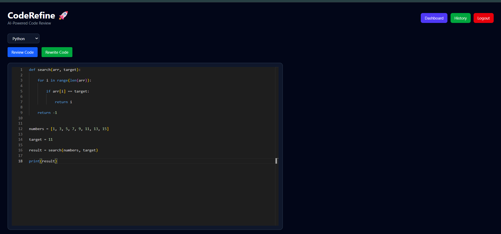

# CodeRefine 🚀

AI-powered Code Review and Optimization Platform.

## Preview



## Features

- AI Code Review
- AI Code Rewrite
- Multi-language Support
- JWT Authentication
- History Page
- Charts and Analytics
- PDF Export

## Tech Stack

### Frontend
- React
- TailwindCSS
- Vite

### Backend
- FastAPI
- SQLAlchemy

### Database
- PostgreSQL (Neon)

### AI
- Groq
- Llama 3.3 70B

## Run Backend

```bash
cd backend
uvicorn app.main:app --reload
```

## Run Frontend

```bash
cd frontend
npm install
npm run dev
```
## Folder Structure

```text
CodeRefine
│
├── backend
│
│ ├── api
│ ├── core
│ ├── db
│ ├── models
│ ├── schemas
│ ├── services
│ └── main.py
│
├── frontend
│
│ ├── components
│ ├── pages
│ ├── services
│ └── App.jsx
│
├── images
│ └── dashboard.png
│
└── README.md
```

## API Features

* User Registration
* Login with JWT Authentication
* Profile Page
* AI Code Review
* AI Code Rewrite
* Review History
* Charts and Analytics
* PDF Export

## Future Enhancements

* Docker Support
* CI/CD Pipeline
* VS Code Extension
* GitHub Integration
* AI Chat Assistant
* Team Collaboration

